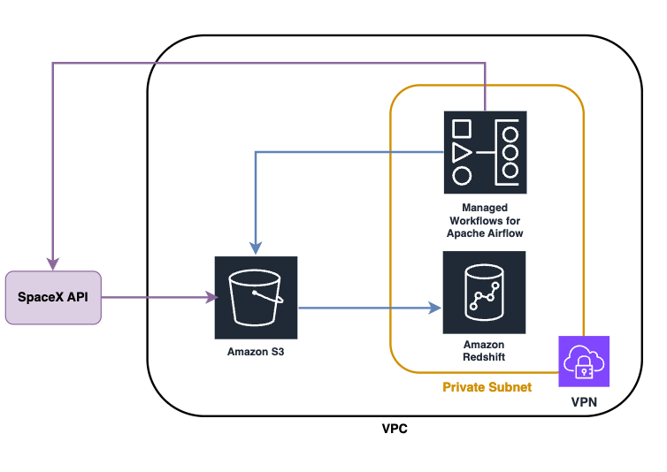

# Data Infrastructure on AWS
## Architectural diagram
The **architectural diagram** for the scalable solution on AWS proposed for this challenge is the following:


It includes S3 as the data storage solution and MWAA as the data processing one.
MWAA has two main pipelines:
- the first one is in charge of extracting data from the SpaceX API and loading it into S3
- the second one processes the S3 data (cleaning, aggregation) and loads it into Redshift where it is accessible for the analytics team

## Security and access control
Regarding **security**, I propose having MWAA and Redshift inside the same Private Subnet and protected by a VPN.

For the **access control** I'd have IAM roles to define every position's privileges/accesses following the *principle of least privilege*. Data Analysts should have access to Redshift, but not to MWAA nor S3 unless justified and Data Engineers should have access to Redshift, MWAA and S3 to ensure the correct functioning of the services.

## Redshift cluster infrastructure creation
In this folder (`sequra_challenge/part-1`), you can find the Terraform files needed to create a simple Redshift cluster on AWS.

### Folder structure

    .
    ├── part-1
    │   ├── images             # Images to be used in the README file
    │   ├── main.tf            # Resources definition (network, security group, IAM role, policy and Redshift
    │   │                        cluster)
    │   ├── provider.tf        # Information regarding the provider required versions
    │   ├── terraform.tfvars   # Defined values to be used in the creation for some of the variables. You can
    │   │                        specify here the `aws_access_key_id` and the `aws_secret_access_key` associated with
    │   │                        the account where the resources should be created, or provide them in the
    │   │                        command line when prompted.
    │   ├── variables.tf       # Variables definition
    │   └── README.md
    └── ...

To create the infrastructure, you just need to run from this same folder:
```
terraform init
terraform plan
```
It should plan to create 12 new resources, if everything went as expected, you can proceed to the creation:
```
terraform apply
```
